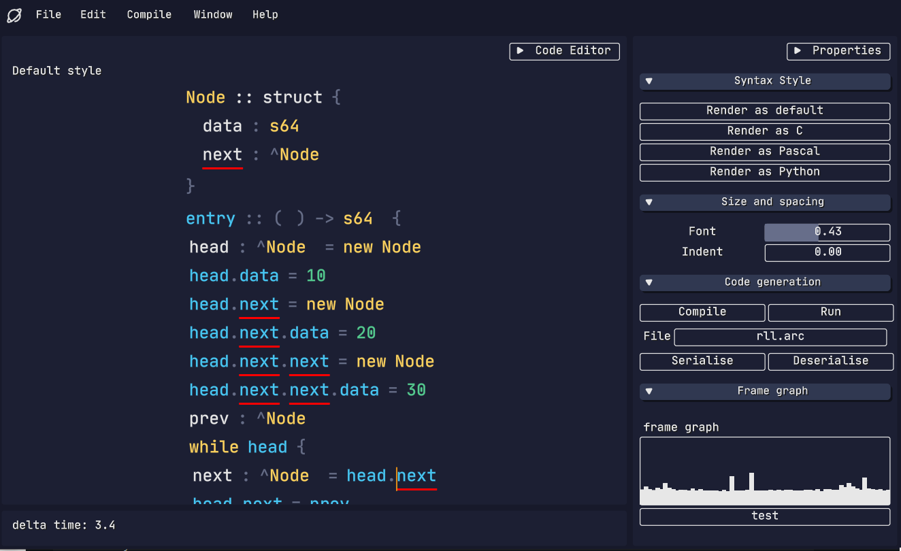

# FRIDAY

test gif showing the language being rendered with arbitrary syntax

this repository includes two custom allocators
    - pool
    - arena

It has a custom opengl batch renderer
    - uses a command queue to draw signed-distance field shapes
        - rectangles
		- rectangle outlines
		- font glyph
		- triangles
		- bezier curves
		- images

I use signed-distance fields for all these shapes for easy outlines and rounded corners.

It also features an auto layout immediate mode GUI.

